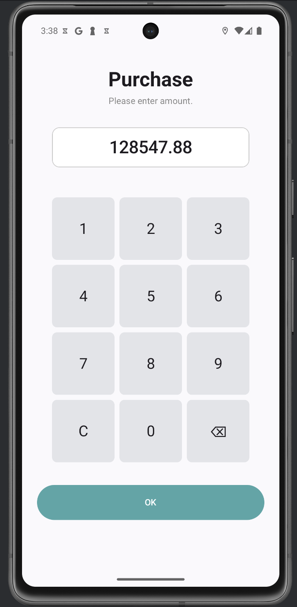
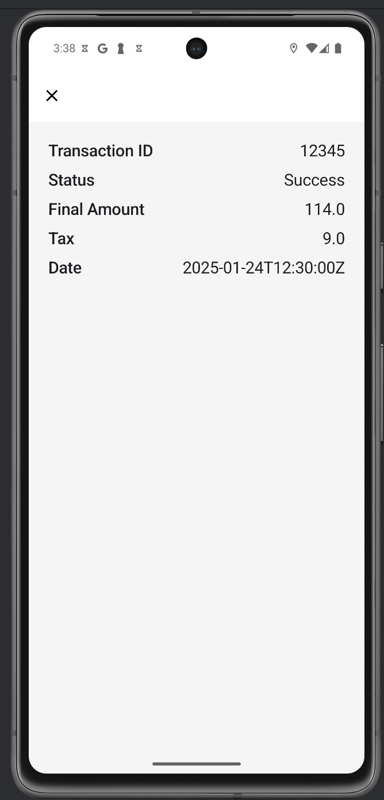

# TechAssignment-IlliaLukiienko

A simple Android Payment App built as part of the Wallee Tech Assignment. The app demonstrates modern Android development practices including Clean Architecture, MVVM, Jetpack Compose, Ktor, and Hilt.

---

## Features

- **PinPad Screen** — UI for entering a transaction amount using a custom keypad  
- **Network Fetch** — Simulates downloading transaction data from an API  
- **Receipt Screen** — Displays receipt details with calculated tax and total  
- **Business Logic** — Tax and total calculations encapsulated in use cases  
- **Pixel-Perfect UI** — Fully styled UI matching Figma design  
- **Unit Tests** — Business logic is covered by tests  
- **Clean Architecture** — Presentation, Domain, and Data layers separated  
- **Dependency Injection** — Managed by Hilt

---

##  Screenshots

| PinPad Screen                             | Receipt Screen                             |
|------------------------------------------|--------------------------------------------|
|         |         |

---

##  Tech Stack

| Layer         | Tools & Libraries                            |
|---------------|-----------------------------------------------|
| UI            | Jetpack Compose, Material3                    |
| DI            | Hilt                                          |
| Networking    | Ktor + Kotlinx Serialization                  |
| Architecture  | MVVM + Clean Architecture                     |
| Testing       | JUnit, MockK                                  |
| Utilities     | StringResourcesHelper for string management   |

---

##  Architecture
├── core
│   ├── theme                    # App theme (colors, typography)
│   └── util                     # Helpers (e.g. StringResourcesHelper)
│
├── data
│   └── repository               # Repository implementations (e.g. ReceiptRepositoryImpl)
│
├── di
│   ├── NetworkModule            # Ktor & JSON setup
│   ├── RepositoryModule         # Provides interfaces -> implementations
│
├── domain
│   ├── model                    # Transaction, Amount, ReceiptUiState
│   ├── repository               # Repository interfaces
│   ├── screen                   # ViewModel communication interfaces (IPinPadScreen, IReceiptScreen)
│   └── usecase                  # Business logic (PinPadUseCase, ReceiptUseCase)
│
├── presentation
│   ├── navigation               # NavGraph
│   ├── ui
│   │   ├── pinpad               # PinPadScreen & components
│   │   └── receipt              # ReceiptScreen & components
│   ├── viewmodel                # PinPadViewModel, ReceiptViewModel
│   └── MainActivity.kt          # Entry point
│
└── PaymentsApp.kt               # Hilt Application class
